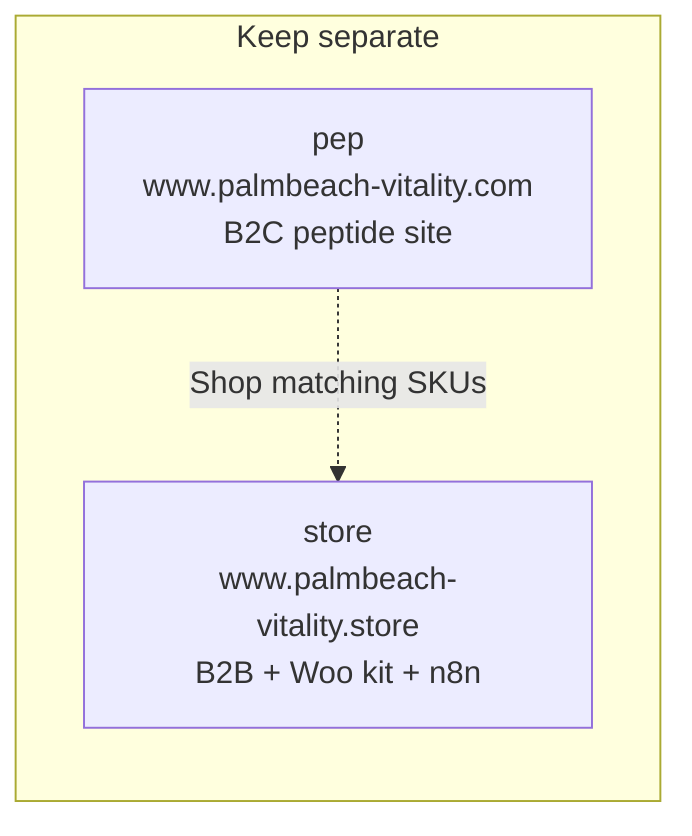

# Palm Beach Vitality (.com / pep)

This repo is **only** `www.palmbeach-vitality.com` (`PalmBeach-Vitality/pep`).

## Repo map (do not cross)

`store` and `pep` stay **separate**. They look similar. They are two sites, two domains, two agents.

- **This agent / this repo is ONLY for `www.palmbeach-vitality.com`** (`PalmBeach-Vitality/pep`).
- **Do NOT edit, push to, or deploy `www.palmbeach-vitality.store`.** That site lives in `PalmBeach-Vitality/store` and is handled by a different agent.
- If a request is clearly for `.store` / the `store` repo, refuse and tell the user to use the store agent. Do not apply `.store` WooCommerce, n8n reel-studio, or commerce-kit work here by mistake.
- Individual-purchase CTAs on `.com` may link to matching `.store` SKUs. That is a link, not a license to edit the other repo.

## Cursor Cloud specific instructions

- This is a **pure static site**. There is no build step, no package manager, no `package.json`, and no dependencies to install. Tailwind is loaded from a CDN at runtime.
- There are **no lint, test, or build commands**. Do not look for them.
- Pages live in per-route folders as `index.html` (e.g. `products/index.html`, `contact/index.html`) plus article pages under `research/`.
- To run it: `python3 -m http.server 8000` from the repo root, then browse `http://localhost:8000/`.
- Interactive behavior is plain vanilla JS embedded in each page: mobile menu toggle and the product category filter on `products/index.html` (`data-filter` vs `data-category`).
- Editing any `.html` file takes effect on a simple browser refresh. There is no hot-reload/watch process.

## Design / Figma typography

- **Minimum font size: 24.** No text in Figma slides, storyboards, decks, or other design deliverables may be smaller than 24pt.
- Labels, captions, metadata, body copy, and placeholders all follow this floor.
- Prefer larger type for titles; keep supporting labels at **24pt or above**.
- Apply this to every project unless Salvatore explicitly overrides it for a specific deliverable.

## Design / Figma images

- **Never crop stills.** Use `scaleMode: "FIT"` (not `FILL`) for storyboard and lookbook images unless Salvatore explicitly asks to crop or zoom.
- Prefer **9:16 portrait frames/pages** for vertical film stills so the full image can fill the page without cropping.
- One still per page when reviewing detail.
